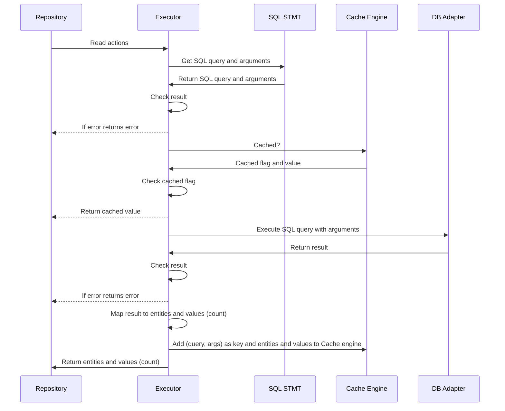
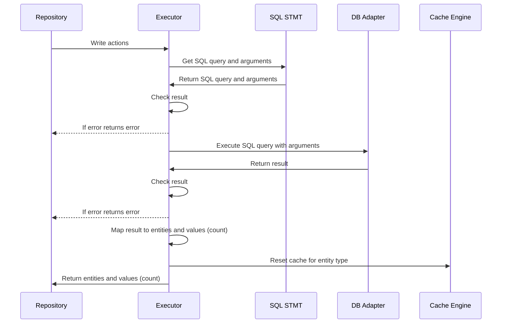

# Executor
Executor is engaged in sending a request to the sql database obtained from sqlstmt. Passes this request to the db adapter and processes the execution result. Before sending, it contacts the caching engine and get the result from it.

## DB Adapters
[Executor database adapters](https://github.com/Insei/gerpo/tree/main/executor/adapters) is advanced layer of abstraction for interaction with sql database.

## Caching Engine
[Caching engine](https://github.com/Insei/gerpo/tree/main/executor/cache) allow cache executions results to storages.

## SQL STMT
SQL query and arguments builder.

## Interactions scheme
### Read

### Write


## Executor examples
```go
    var dbAdapter executor.DBAdapter // already initialized db adapter
    // Caching ctx
	// ctx.New
	// Bundle
    bundle := cache.NewModelBundle[Model]()
    cacheEngineOption := executor.WithCacheSource()
    exec := executor.New[Model](dbAdapter, cacheEngineOption)
```